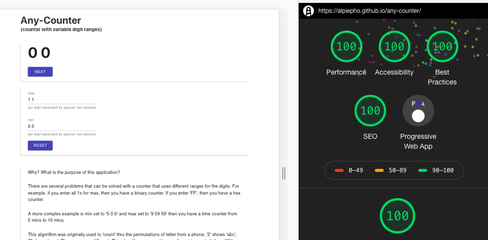

One of the [LeetCode](https://leetcode.com/) problems I recently worked on involved getting all the letter permutations from a sequence of numbers of a phone.  I had an idea to build a counter that where the digits for each place could vary.

I'm kind of a geek, so the idea seemed cool to me.  And it seemed like it would be a cute Progressive Web App (PWA).  It took about 4 hours total with Gatsby.   (You can find it [here](https://alpiepho.github.io/any-counter) ).

I was very surpised when I tested it with the Chrome Dev Tools Audit (LightHouse) and I got a perfect score!!!

Maybe I'm biased, but it seems to me that the combination of Gatsby and PWAs is going to be big.  The real power will be when apps that tie to significant backends like Wordpress hit the scene.  Then those technologies will really take off. :rocket: