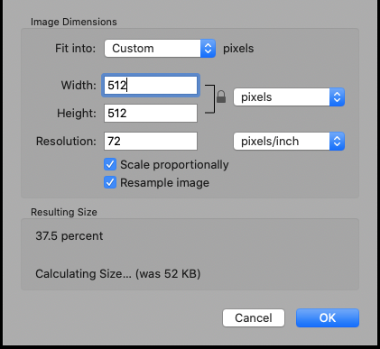
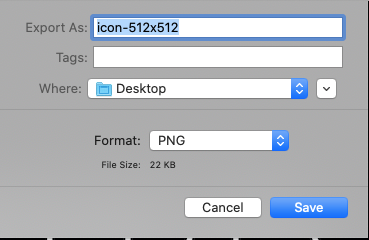

## Icons

I didn't plan on this being the first part of the series, but when I ran into this
recently while trying to clean up the repo/page for [css-grid-resume](https://github.com/alpiepho/css-grid-resume)
 I realized that it might be good to get this out of the way.

Having to deal with the various size icons to support PWA (Progressive Web Applications)
 and favicons ( that little icon in the browser tab) can be a pain.  It always takes me 
 out of the flow of coding (:rocket:) and deploying a simple site. 

It tursn out that Gastby takes care of most of that work...but this series is not a Gastby
site and needs to be handled manually.

### Steps on a Mac

The steps I used are for a Mac with the native application "Preview":

- copy base JPEG image to icon-512x512.jpeg
- open with Preview
- Tools::Resize
- Change to 512x512
- Save (as icon-512x512.jpeg)
- repeat for: 384x384, 256x256, 192x192, 180x180, 144x144, 128x128, 96x96, 72x72, 64x64, 48x48



- again using Preview, open icon-512x512.jpeg
- Export
  - export as PNG
  - will save icon-512x512.png 
- repeat for all sizes
- copy icon-64x64.png as favicon.ico
- copy all generated png to an "icons" folder in your project
- copy favicon.ico to the rool of your project




### Edit manifest.json

You may need to edit your manifest.json file if the file names or paths don't match.

Here is the manifest.json file from css-grid-resume:

```
{
  "name": "css-grid-resume",
  "short_name": "css-grid-resume",
  "theme_color": "#d36060",
  "background_color": "#f08e8e",
  "display": "standalone",
  "start_url": ".",
  "icons": [{
      "src": "icons/icon-48x48.png",
      "sizes": "48x48",
      "type": "image/png"
    },
    {
      "src": "icons/icon-72x72.png",
      "sizes": "72x72",
      "type": "image/png"
    },    {
      "src": "icons/icon-96x96.png",
      "sizes": "96x96",
      "type": "image/png"
    },
    {
      "src": "icons/icon-144x144.png",
      "sizes": "144x144",
      "type": "image/png"
    },
    {
      "src": "icons/icon-192x192.png",
      "sizes": "192x192",
      "type": "image/png"
    },
    {
      "src": "icons/icon-256x256.png",
      "sizes": "256x256",
      "type": "image/png"
    },
    {
      "src": "icons/icon-384x384.png",
      "sizes": "384x384",
      "type": "image/png"
    },
    {
      "src": "icons/icon-512x512.png",
      "sizes": "512x512",
      "type": "image/png"
    }
  ],
  "splash_pages": null
}
```


### Alternatives

I am certain there are other tools that can do this from a command line.  You should be able to Google for them.


## See the other parts:
- [CSS Grid Resume - Part 2 - HTML/CSS](../css-grid-part02)
- [CSS Grid Resume - Part 1 - Icons](../css-grid-part01)
- [CSS Grid Resume - Part 0 - Start](../css-grid-part00)
