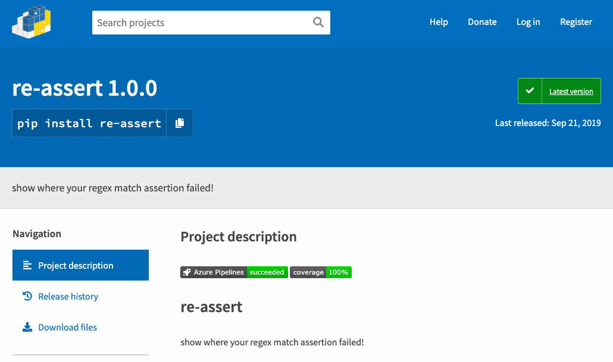
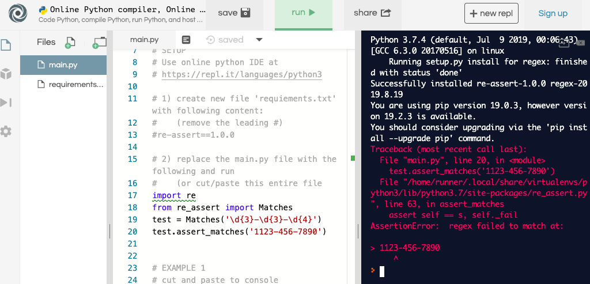

I found a cool python package to help build regular expressions.
It throws an assert showing where a string doesn't match.

This is a pypi package called [re-assert](https://pypi.org/project/re-assert/).

 
The description of re-assert are a little sparse and it wasn't really clear
how to use it.

I wanted an easier way to use this package to debug regex expresions, so I built a 
set of [instructions](https://gist.github.com/alpiepho/144cc3e2a938cf71164a42d4a86488b0) 
for using this with repl.it, a great online build environment.

 
The online site "repl.it" is an awesome tool.

Probably need to sign up for repl.it.  After I found this (I wanted to help my
son with a Java assignment, but DID NOT want to install Java), I heard a [podcast](https://softwareengineeringdaily.com/?s=repl.it)
with the founder.  You really should check it out.
