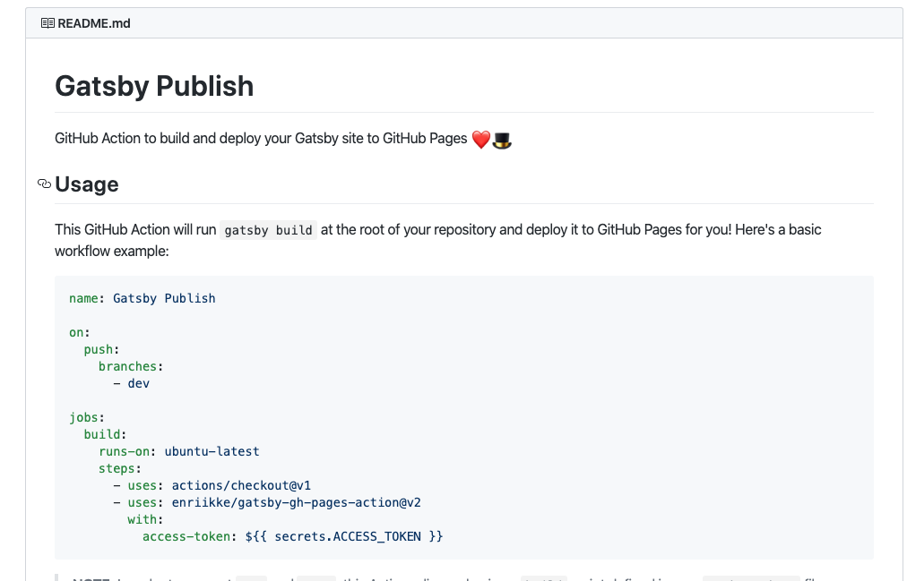

Original Date: April 13, 2020 ....

In the last 6 months Github relased a feature called "Actions" that lets developers script the deploy steps
triggered by actions like commiting to a Github repo.

I found an example "action" to automate the deploy of a Gatsby web application to a Github page...and tried 
if for this blog site.  Here is the [action](https://github.com/marketplace/actions/gatsby-publish).

The commit for blog entry **should** trigger the automated deploy of the site.

Here we go...

So, it actually worked! So what should you do if you have something working...try to break it!

I wanted to better understand how this GH Action script worked.  I forked the original [here](https://github.com/alpiepho/gatsby-gh-pages-action)
and started making modifications.

- first I changed all github references to mine, "alpiepho"
- I noticed that the original had committed the 'node_modules' artifact directory (from yarn install)
- removed 'node_modules' and created a .gitignore file
- then changed this blog site to use the fork 
- and it worked...or I thought it did
- realized that this blog site was used a "release" from the fork of gatsby-gh-pages-action
- the release was actaully carried over from the orignal action repo
- how hard can this be, created a new version, v3 
- tried with this blog...crap, it fails!??
- looking thru the logs of the failed action, turn out I do need the 'node_modules'
- added 'node_modules' back into the my gatsby-gh-pages-action fork
- new version, v3.1
- and now it works again

So what did I learn?  Don't mess with something that already works?  No, gh-action projects need **ALL**
the files required to run.  I think it might be possible to setup the gh-action to run a script that
calls 'yarn install' first, but that might not save much time or effort.

Thanks for following along on my gh-actions adventure.

