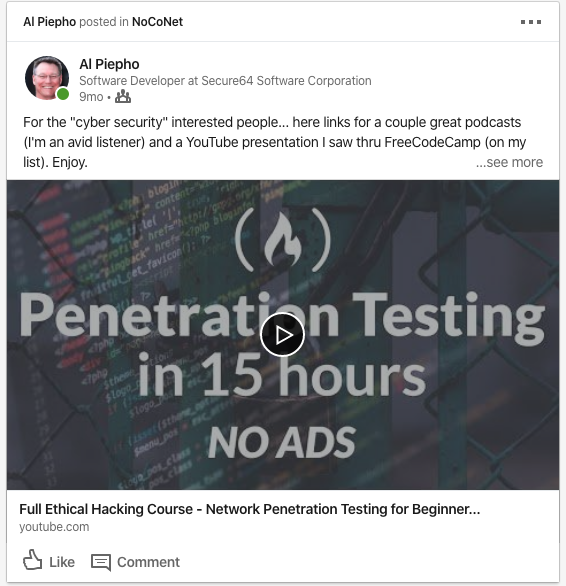
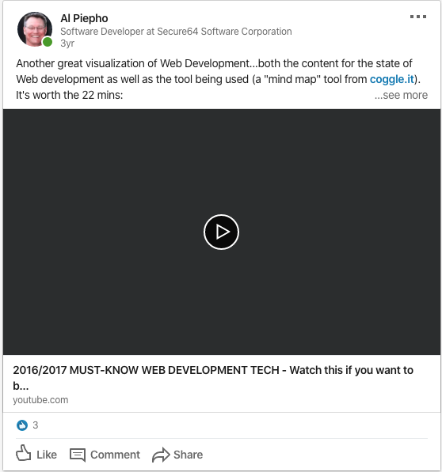

(Warning: many images) This a summary of all the Linked-In posts I have added over the years.  Most of them re-directs to cool things I have seen.

[COBOL is scarry (must be, only 1 view, thanks Bob!)...](https://www.linkedin.com/posts/al-piepho-fw-sw-engineer_who-needs-netflix-when-you-can-learn-cobol-activity-6658698462793654272-vrdM)

[Social Distancing...](https://www.dreamteee.com/campaigns/page/2/stores/engineer/software-engineer-social-distancing?retailProductCode=6369D664D7F4E3-42928AE583BE-GS0-TC0-BLK)

[Funny...](https://medium.com/javascript-in-plain-english/30-funny-code-comments-that-will-make-you-laugh-1c1b54d4ab00)

[Drive By??](https://www.forbes.com/sites/zakdoffman/2020/02/05/fbi-drive-by-hacking-warning-just-got-real-heres-how-this-malicious-new-threat-works/#13a302095017)

[10 Github Sites](https://medium.com/better-programming/10-awesome-github-repos-every-web-developer-should-know-15288c8533f1)

[GraphQL](https://www.youtube.com/watch?v=783ccP__No8)

[Edge Computing...](https://softwareengineeringdaily.com/2020/01/14/edge-computing-platform-with-jaromir-coufal/)

[Only for debuggers...](https://www.onlinegdb.com/)

[Base64](https://medium.com/swlh/powering-the-internet-with-base64-d823ec5df747)

[70 Hello](https://medium.com/javarevisited/70-years-of-hello-world-with-50-programming-languages-2400de893a97)

[On Ice...](https://lnkd.in/ekTeScP)

[FCC 5 Years](https://www.freecodecamp.org/news/the-future-of-freecodecamp-5-year-anniversary/)

[USB Flavors](https://www.freecodecamp.org/news/usb-c-port-explained-how-usb-type-c-is-different-and-how-fast-it-is/)

[Atari and Chuck E. Cheese](https://acquired.libsyn.com/season-5-episode-5-atari-with-nolan-bushnell)

[PWAs](https://ymedialabs.com/progressive-web-apps)

[Python again](https://www.youtube.com/playlist?list=PLlrxD0HtieHhS8VzuMCfQD4uJ9yne1mE6)

[You are work](https://humanparts.medium.com/you-are-your-work-and-thats-a-good-thing-4ac468505a2a)

[New Podcast](https://www.intelligencesquaredus.org/news/blog/discourse-disrupters-new-podcast-series)

[Replit](https://repl.it/)

[I got Swag](https://media-exp1.licdn.com/dms/image/C5622AQG0Rd-of3bzfQ/feedshare-shrink_2048_1536/0?e=1589414400&v=beta&t=3bLsDwjmG1MuKEuRw6YZ10NMp-U6j1aGwe8gN4e9I58)

[Pen Testing](https://youtu.be/3Kq1MIfTWCE)

[JAM Stack](https://blog.logrocket.com/the-best-static-websites-generators-compared-5f1f9eeeaf1a/)

[Bash again](https://www.linkedin.com/learning/learning-bash-scripting?isLearningSubscriber=true&trk=feed-share_course_title_learning&lipi=urn%3Ali%3Apage%3Ad_flagship3_profile_view_base_recent_activity_details_shares%3BLo2woTcdTi6Y4AkDMKWjyg%3D%3D&licu=urn%3Ali%3Acontrol%3Ad_flagship3_profile_view_base_recent_activity_details_shares-viewCourse&lici=yuwKUNXVqefuX5pt2OSo6g%3D%3D)

[State of CSS](https://2019.stateofcss.com/)

[HTTP2](https://blog.cloudflare.com/better-http-2-prioritization-for-a-faster-web/)

[Patents Explained](https://www.akimbo.me/blog/s-3-e-8-all-rights-reserved)

[Mellennials](https://www.linkedin.com/feed/update/urn:li:activity:6465153012187832320/?lipi=urn%3Ali%3Apage%3Ad_flagship3_profile_view_base_recent_activity_details_shares%3BLo2woTcdTi6Y4AkDMKWjyg%3D%3D)

[Dot Net Rocks](https://www.dotnetrocks.com/?show=1508)

[Terry Crews](https://tim.blog/2017/12/20/terry-crews-how-to-have-do-and-be-all-you-want/)

[I said No](https://lnkd.in/eApnB-p)

[Cheap Computers](https://www.anandtech.com/show/12037/cheap-supercomputers-lanl-has-750node-raspberry-pi-development-clusters)

[I think I see one](https://lnkd.in/ekcD4Ka)

[Blink Blink Blink](https://css-tricks.com/look-back-history-css/)

[Notch](https://medium.com/the-mission/iphone-x-top-notch-204e9284f54a)

[Bot Time...](https://medium.com/fast-company/i-built-a-bot-to-apply-to-thousands-of-jobs-at-once-heres-what-i-learned-46ece659593e)

[Jokes for Geeks](https://hackernoon.com/jokes-programmers-will-understand-23d484d8bef8)

[Technical Debt](https://medium.freecodecamp.org/tame-your-tech-debt-by-refactoring-more-often-fcc34dd24a33)

[Paid to Learn](https://medium.com/@michaelmangial1/the-best-way-to-learn-development-skills-while-getting-paid-in-the-process-a31bfb138287?source=email-f9f2ea2b1d81-1497958095082-digest.reader------0-38&sectionName=top)

[/regex/](http://emailregex.com/)

[Machine Learning](http://www.r2d3.us/visual-intro-to-machine-learning-part-1)

[CSS Anination](https://daneden.github.io/animate.css)

[Web Visualizations](https://www.youtube.com/watch?v=sBzRwzY7G-k)

[Why Web is so messed up](https://medium.freecodecamp.com/a-roadmap-to-becoming-a-web-developer-in-2017-b6ac3dddd0cf)
