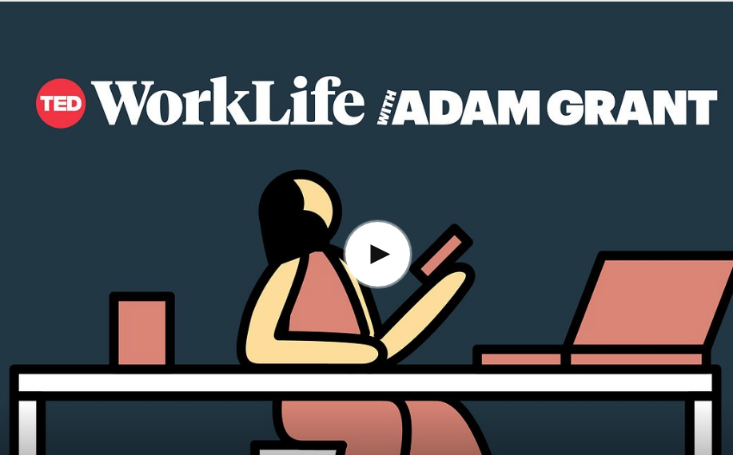

A recent podcast I listened to had a great back story on the founder of Lynda.com, the
learning website that became "LinkedIn Learning".  The second half of this [episode](https://www.ted.com/talks/worklife_with_adam_grant_career_decline_isn_t_inevitable) 
of "Work Life w/ Adam Grant" has a brief interview with the founder about how she 
started the site later in life.

I find it facinating to hear some history of a site I use a lot.
