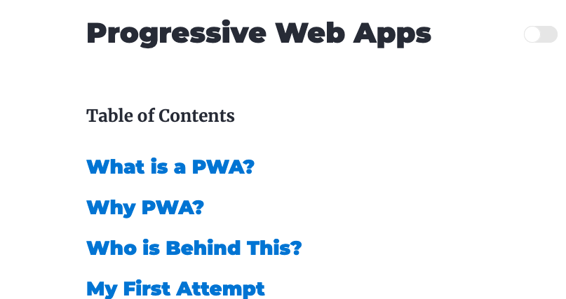

For some crazy reason, I volunteered to do a presentation about PWAs
(Porgressive Web Apps)...that's the last time I speakup in Another
presentation.  Can't believe he called me out :)

Since this was going to be a talk on PWAs I thought it would be
clever to build the slides as a REAL PWA.

At the time, I was also experimenting with the new Gatsby Themes.
So why not combine the two efforts.  

It took a few weeks, but I have build my own theme starter based on
the official Gatsby Blog Theme (uses lots of shadowing...really need
to create my own npm package).  Then I used that to build the
slides for the presentation:

- [gatsby-starter-theme-slides](https://github.com/alpiepho/gatsby-starter-slides-theme)
- [pwa-presentation](https://github.com/alpiepho/pwa-presentation)

I definitely learned alot about Gatsby Themes.  Hopefully the 
presentation goes well...not to late to bail, right? :)