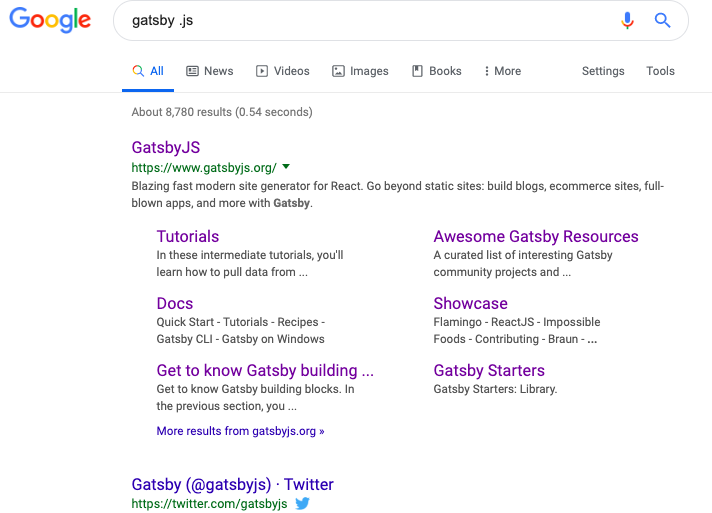
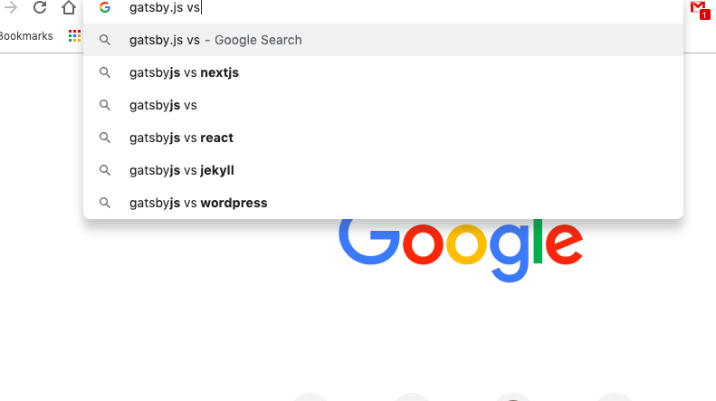
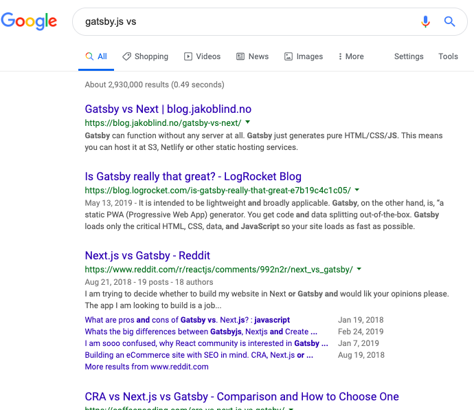

Ever have one of those moments where your realize that you instintively do something that is efficient and useful, and maybe you should share it.

I had one of those moments last night explaining to my son how he could better search for a new laptop.

This might be obvious to most people, but when I do a Google search for something with just the name of that 'thing', I get alot of results from the source of the thing, and very little context.  However if you add 'vs' you get a lot of ideas from the type-ahead, and them from the results. 

For example, lets look at 'Gatsby.js' (a new framework on top of React.js to build server-side-rendered web sites...awesome :clap:):

Now use 'vs' and look at the type-ahead:

Notice the context of Gatsby.js (read this as "Gatsby.js is often compared to nextjs, React, to Wordpress...).

And finally execute the search:

I think this provides a great deal of context to learn about some 'thing'.  Like I said before, I use this so often I forget that I'm doing it....Maybe Google should add this as a 'vs' button.

Try this tip in the future when you want see both the pros and cons of a product or idea.  Have fun. :sunglasses: