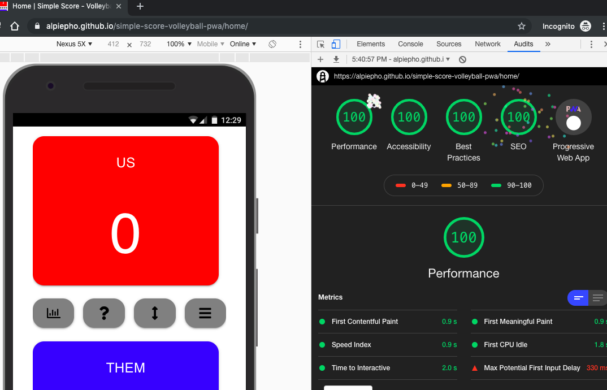

This took longer than expected, but I just got a MVP for my volleyball app, [Simple Score Volleyball PWA](https://github.com/alpiepho/simple-score-volleyball-pwa/).  Not a React Native app, but a PWA. (and it does well with Lighhouse.)

I started with my "any-base-counter" Gatsby app, and built a multi-screen application that lets someone quickly score a volleyball match, and periodically, send the current state as a text 
to a pre-set list of phone number.

## What did I learn

Using Material UI is tricky.  Nice, but if you want to use normal CSS you end up fighting things.

Transfering state between pages is ugly.  Not sure if it was a good
idea or not, but I ended up saving the data to local storage, them
picking that up in the next page....yes global variables!

This was my first time working with a Netlify Function/Lambda.  Simple but nice to know how to do it.

Also my first time working with a service like Twilio.  Now I understand how easy it is to generate robo-calls :(

Another fun project.  I'm a little nervous releasing this to my daughters team/parents.  Hope they are gentle....

