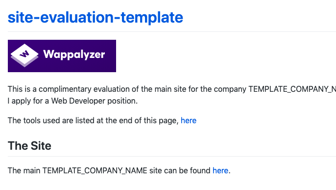
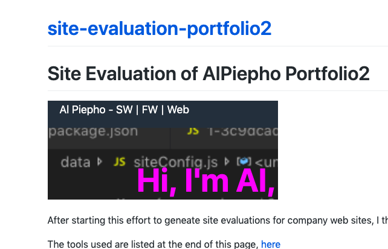
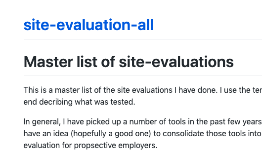

As I have tried to learn more about developing websites, I have gathered a number of tools that I use to inspect sites.  I was looking at a site for a company I was interested in interviewing with and noticed some issues with their site.  Then I had the idea...

"I could build a quick report about their site.  Might allow me to stand out".  

So I did that.

First I built a [template](https://alpiepho.github.io/site-evaluation-template/).

Then I did some real evaluations, like [this one](https://alpiepho.github.io/site-evaluation-portfolio2/) for my own portfolio site.

The full list can be found [here](https://alpiepho.github.io/site-evaluation-all/).

This process has already given me some other expansion ideas:

- Look at Firefox
- Automate process
- Look closer at Wappalyzer
- Use Puppeteer/Web Crawling to inspect more pages
- Use Puppeteer/Web Crawling to scaffold replacement site
- Use Puppeteer/Web Crawling to compare replacement site to original

Only time will tell if this is a good idea.  In the mean time, this is a good process for me to keep building evaluation tools.

