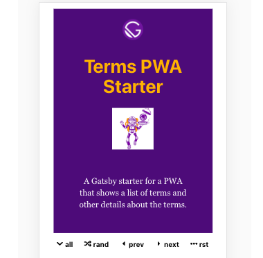
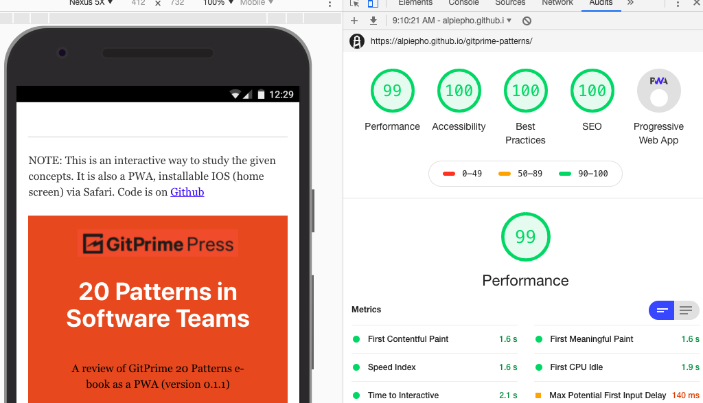

I just remembered that I didn't blog about my first PR to the Gatsby.js project....YEAH FO ME!  I even got a hat.

So I had another idea to build a Gatsby Starter.  Recently I saw an e-book (one of those that require signing up os they get your email), Called "20 Patterns to Watch for in Your Engineering Team" from a company GitPrime.  GitPrime builds tools to evaluate git history and pick up trends etc.

I thought the book was really good, and i like the company...might even be worth trying to work there.  In the past, I have build list-like PWA apps for other companies, and this seemed like another place to build one.  I took this a step further, and built a real Gatsby Starter [Terms PWA Starter](https://alpiepho.github.io/terms-pwa-starter/):

Then I built a PWA for the [20 Patterns book](https://alpiepho.github.io/gitprime-patterns).  The starter itself, took 2-3 days total.  Once the starter was in place, the 20 Pattens PWA was 1/2 a day!

## What did I learn

First, I started using GitHub issues and branches for the features.  I really need to use different tags for bugs vs features etc.  I also need to use real Pull Requests and clean up branches.

Also, I tried to list all the little details to change.  There are many, and scattered.  I probably missed a few.

The hardest part rolling in GraphQL.  All the examples I found either used dynamic requests, like via Axios, or used React Functional Components, rather than classes.  The good news, is I gain alot of experience refactoring classes to functional components.

Fun project.  Guess we will see if I get any traction with the starter or the 20 Patterns app. :smile:

